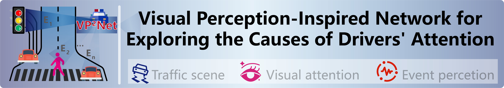

<div align="center">



<b>Authors:<a href="https://scholar.google.com/citations?user=IOeG3ygAAAAJ&hl=zh-CN" target="_blank">Chunyu Zhao</a>, 
<a href="https://scholar.google.com/citations?user=WQ2hfUYAAAAJ&hl=zh-CN" target="_blank">Tao Deng</a><sup>📧</sup>, 
Pengcheng Du, 
<a href="https://scholar.google.com/citations?user=evBOeoAAAAAJ&hl=zh-CN" target="_blank">Wenbo Liu</a>, 
<a href="https://scholar.google.com/citations?hl=zh-CN&user=q3kc2R8AAAAJ" target="_blank">Yi Huang</a>, 
Fei Yan
</b> 
<br>
<b>Contact: springyu.zhao@foxmail.com&nbsp;&nbsp;&nbsp;&nbsp;&nbsp;&nbsp;📧: corresponding author </b>

</div>

## 💻Dataset

Through the process of re-labeling, we obtain an attention-based driving event dataset (ADED) consisting of 1101 videos. The dataset provides semantic annotation for each driving video, and the semantic information contains annotations of driving event categories and driving event time windows. The driving event categories contain six categories, which are Driving Normally (DN), Avoiding Pedestrian Crossing (ACP) Waiting for Vehicle Ahead (WVA), Waiting for Red Light (SRL), Stop Sign Stopping (SSS) and Avoiding Lane Changing Vehicle (ALC).

<div align="center">


</div>

<div align="left">
<b>Fig. 1. ADED dataset annotation process</b>. On the left is the annotation process for the entire ADED dataset. The heatmaps are derived from the BDD-A dataset, captured through eye-tracking devices to represent driver’s attention. On the right is the annotation process for event time windows of driving event.
</div>

<div align="center">


</div>

<div align="left">
<b>Fig. 2. ADED dataset statistics</b>. (a) The number and proportion of each driving event class. (b) The distribution of the duration of driving events. (c) The distribution of the occurrence of driving events along the timeline.

</div>

<div align="center">
<b>TABLE I:</b> Comparison of Traffic Scene Datasets in Terms of Weather Conditions, Annotations, and Videos. <b>TABLE II:</b> Comparison of DADA-2000, PSAD, And Our Dataset in Terms of Statistical Properties and t-SNE Feature Visualization.

</div>

<div align="center">


</div>


## ✨Model

<div align="center">


</div>


<div align="left">
<b>Fig. 3. Perception-inspired Network (VP²Net).</b> Our model takes driving video sequences as input, where the SIE branch extracts bottom-up driving scene information and the APE branch extracts top-down driver attention information (which undergoes attention perception — “where to focus”, attention enhancement — “when to focus”, and information encoding). Subsequently, attention information guides the fusion of driving scene features, further decoded to produce the output. F1 is the attention information encoder. F2 is the event information decoder.

</div>


## 🚀 Quantitative Analysis

<div align="center">
<b>TABLE III:</b> Quantitative Results of Different Models on the ADED, DADA-2000, PSAD Datasets.

</div>

<div align="center">


</div>

## 🚀Visualization of Intermediate Results

<div align="center">


</div>

<div align="left">
<b>Fig. 4. The Proposed Visual Dual Perception-inspired Network (VP²Net).</b> Our model takes driving video sequences as input, where the SIE branch extracts bottom-up driving scene information and the APE branch extracts top-down driver attention information (which undergoes attention perception — “where to focus”, attention enhancement — “when to focus”, and information encoding). Subsequently, attention information guides the fusion of driving scene features, further decoded to produce the output. F1 is the attention information encoder. F2 is the event information decoder.

</div>


## 💖Support the Project

Thanks to the open-source video action detection models (ViViT, VideoMAE) at [huggingface🤗][10]  for supporting this paper.

[10]: https://huggingface.curated.co/	"huggingface"

## 📄Cite

If you find this repository useful, please use the following BibTeX entry for citation  and give us a star⭐.

```python
@article{zhao2025vp2net, 
  title={VP²Net: Visual Perception-Inspired Network for Exploring the Causes of Drivers’ Attention Shift}, 
  journal={IEEE Transactions on Intelligent Ttansportation Systems}, 
  author={Zhao, Chunyu and Deng, Tao and Du, Pengcheng and Liu, Wenbo and Huang, Yi and Yan, Fei}, 
  year={2025}
}
```

